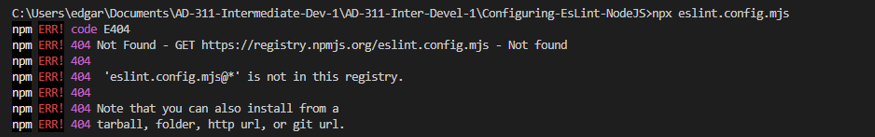

# ESLint Configuration Assignment

## Objective Gain hands-on experience in setting up and configuring ESLint in a Node.js project to ensure code consistency and avoid potential bugs.

---

## Project Setup
1. Initialized a Node.js project using `npm init -y`.
2. Installed ESLint as a development dependency.
3. Created `eslint.config.mjs` and configured rules for:
   - Semicolons (`semi: ["error", "always"]`)
   - Double quotes (`quotes: ["error", "double"]`)
4. Created `index.js` with intentional errors to test ESLint.
5. Ran `npx eslint index.js` to detect missing semicolons and wrong quotes.
6. Optionally, ran `npx eslint index.js --fix` to automatically correct the errors.

### 1. Initialize a New Node.js Project
- Created a new directory for the project.
- Navigated into the directory using the terminal.
- Ran `npm init -y` to generate a `package.json` file.

### 2. Install and Configure ESLint
- Ran `npm init @eslint/config` to start the ESLint setup tool.
- Followed the prompts: - Linting JavaScript files
- Using CommonJS modules
- No framework
- No TypeScript
- Code runs in Node.js
- Chose JavaScript format for the config file
- ESLint generated the file `eslint.config.mjs`.

---

## ESLint Configuration

### 3. Exploring ESLint Configuration
Opened `eslint.config.mjs` and reviewed the default rules and structure created by ESLint’s new Flat Config system. 

### 4. Modifying ESLint Rules
Updated the following rules to match my preferred coding style:

```js
rules: {
    semi: ["error", "always"],
    quotes: ["warn", "single"]
}




